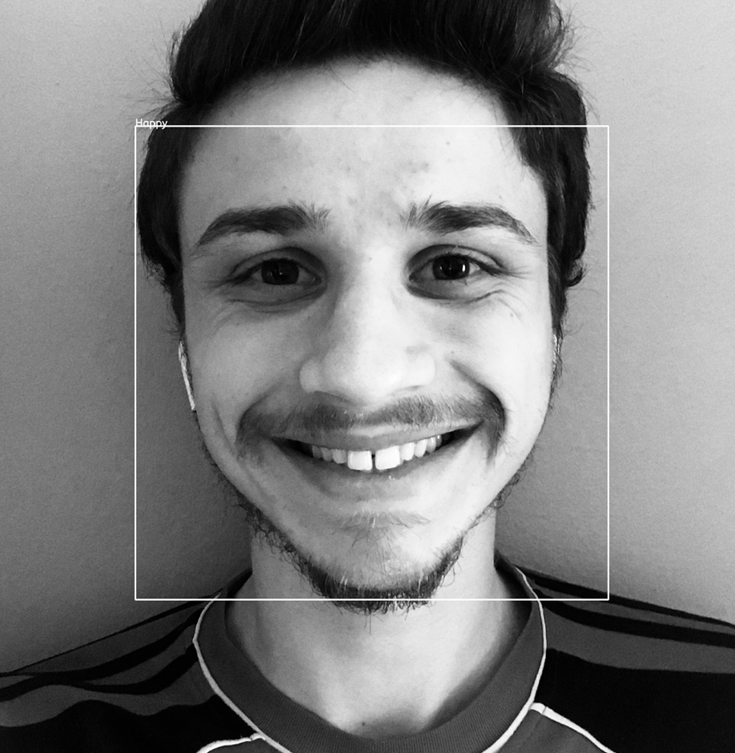

# FaceX - Edge Computing

FaceX is a `personal project` that allows you to get information about `people emotions` based on `their face`.

The purpose of this project is to show you a demo of how a system like this can be used. The project is intended to work on the edge devices like Raspberry Pi 4 and others.

## Table of contents
* [Demo](#demo)
* [Requirements](#requirements)
* [Setup](#setup)
* [Features](#features)
* [Status](#status)
* [Inspiration](#inspiration)
* [Contact](#contact)

## Demo

## Requirements
* TensorFlow - version 2.2.0
* OpenCV - version 4.1.2
* tensorboard - version 2.1.1
* scikit-learn - version 0.23.1
* matplotlib - version 3.2.1
* seaborn - version 0.10.1
* pandas - version 1.0.4
* plotly - version 4.8.1
* numpy - version 1.18.4

## Setup
Describe how to install / setup your local environement / add link to demo version.

## Code Examples
Show examples of usage:
`put-your-code-here`

## Features
List of features ready and TODOs for future development
* Based on the emotions frequency the app shows you a bar chart.

To-do list:
* Improve the performance of the model
* Get relevant data for trainig
* Get quality data 

###### The application doesn't have some complex features, because it wasn't the purpose.

## Status
Project is: _in progress_, because the purpose of the project was to get more knowledge about Edge Computing and ML tools. However, for more development this project is a good start point.

## Inspiration
The project was built for improving my machine learning and data science skills. Also, the inspiration was brought by a very good friend of mine who has a in-depth vision in this field. 

## Contact

If you want to contact me feel free to reach me at <paul_damsa9@yahoo.com>.
